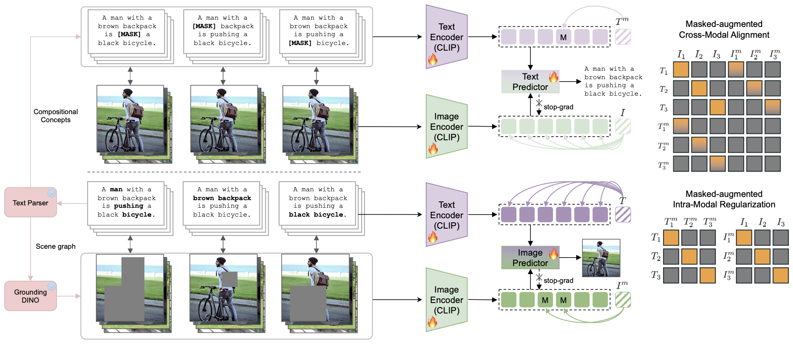

<h1 align="center">
  Cross-Modal Masked Compositional Concept Modeling for Enhancing Visio-Linguistic Compositionality
</h1>

<p align="center">
  <a href="#"></a>
  <a href="https://huggingface.co/hiker-lw/MACCO"></a>
  <a href="https://huggingface.co/datasets/hiker-lw/VL-Compositionality-Benchmarks"></a>
</p>

<h4 align="center">
 Official repository for MAsked Compositional Concept MOdeling (MACCO), ACL 2026 Long Paper.
</h4>

## 📌 Introduction

Contrastively trained vision-language models such as CLIP have made remarkable progress in learning joint image-text representations, but still face challenges in compositional understanding. They often exhibit a "bag-of-words" behavior, struggling to capture object relations, attribute-object bindings, and word order dependencies.

This limitation arises not only from the reliance on global, single-vector representations for optimization, but also from the insufficient exploitation and modeling of the rich compositional information inherently present in paired image-text data.

In this work, we propose **MACCO** (**MA**sked **C**ompositional **C**oncept M**O**deling), a framework that masks compositional concepts in one modality and reconstructs them conditioned on the full contextual information from the other modality, enabling the model to capture and align cross-modal compositional structures more effectively. To facilitate this process, we introduce two auxiliary objectives that jointly align and regularize masked features both inter-modally and intra-modally.

Extensive experiments on five compositional benchmarks, along with in-depth analyses, demonstrate that MACCO not only significantly enhances compositionality in VLMs but also improves their ability to capture syntactic structure and linguistic information. Additionally, the improved compositionality further benefits text-to-image generation and multimodal large language models.

<p align="center">
  
  <br>
  <em>Overview of MACCO.</em>
</p>

## 🛠️ Environment

We provide both `requirements.txt` and `environment.yml` for environment setup.

### Option 1: Install with conda

```bash
conda env create -f environment.yml
conda activate macco
```

### Option 2: Install with pip

```bash
conda create -n macco python=3.12.9
conda activate macco
pip install -r requirements.txt
```

## 📂 Data Preparation

Please organize all datasets under the `datasets/` directory.

### 1. Training Data

We use the COCO dataset for training by default. Please download the COCO images and place them under `datasets/coco/`.

The expected file structure is:

```text
datasets/
└── coco/
    ├── train2014/
    ├── val2014/
    └── test2014/
```

#### Optional: CC3M Subset

As an optional alternative, you can also train the model on the CC3M subset. Please download the dataset from [cc3m-subset-100k](https://huggingface.co/datasets/ytaek-oh/cc3m-subset-100k), extract the images, and organize the files as follows:

```text
datasets/
├── coco/
└── cc3m-subset-100k/
    ├── coca_captions/
    └── images/
```

The corresponding training annotation file is `cc3m_subset_100k_object_relation_attribute_with_phrase_bbox.tsv`.


### 2. Evaluation Data

Please download the compositional evaluation benchmarks from Hugging Face:

```text
https://huggingface.co/datasets/hiker-lw/VL-Compositionality-Benchmarks
```

After downloading and extracting the files, place them under the `datasets/` directory.

The expected file structure is roughly:

```text
datasets/
├── ARO/
├── VL_checklist/
├── sugar-crepe/
├── VALSE/
├── whats_up_data/
└── other evaluation files...
```

Please adjust the directory names according to the paths used in the evaluation scripts.

### 3. Notes for VL-Checklist

The VL-Checklist files are relatively large and are split into multiple parts. After downloading, the files may look like this:

```text
hake.tar.gz.part-000
hake.tar.gz.part-001
hake.tar.gz.part-002
hake.tar.gz.part-003
hake.tar.gz.part-004
hake.tar.gz.part-005
hake.tar.gz.part-006
hake.tar.gz.part-007
hake.tar.gz.part-008
hake.tar.gz.part-009

swig.tar.gz.part-000
swig.tar.gz.part-001
swig.tar.gz.part-002

vg.tar.gz.part-000
vg.tar.gz.part-001
vg.tar.gz.part-002
```

Please concatenate the split files before extraction:

```bash
cat hake.tar.gz.part-* > hake.tar.gz
cat swig.tar.gz.part-* > swig.tar.gz
cat vg.tar.gz.part-* > vg.tar.gz
```

After extraction, please organize the VL-Checklist dataset as follows:

```text
datasets/
└── VL_checklist/
    ├── VL_checklist_datasets/
    │   ├── data/
    │   ├── hake/
    │   ├── swig/
    │   └── vg/
    └── VL_checklist_json_data/
```

## 🚀 Training

To train MACCO, run:

```bash
sh scripts/train_MACCO_CLIP.sh
```

Please check and modify the dataset paths, checkpoint paths, batch size, and GPU settings in the script according to your own environment.

## 🔍 Evaluation

We provide evaluation scripts under the `eval/` directory.

```bash
cd eval
python evaluate_comp_benchmark.py
python evaluate_aro_order.py
python evaluate_vl_checklist.py
```
Please make sure that the corresponding datasets and checkpoints are correctly placed before running evaluation.

## 🤗 Pretrained Checkpoints

The pretrained checkpoints of MACCO are available at:

```text
https://huggingface.co/hiker-lw/MACCO
```
All pretrained checkpoints provided in this repository are trained on COCO.

## 🖋️ Citation

If you find our work useful for your research, please consider citing:

```bibtex
@inproceedings{li2026macco,
  title={Cross-Modal Masked Compositional Concept Modeling for Enhancing Visio-Linguistic Compositionality},
  author={Li, Wei and Huang, Zhen and Tian, Xinmei},
  booktitle={Proceedings of the 64th Annual Meeting of the Association for Computational Linguistics},
  year={2026}
}
```

## 🙏 Acknowledgements

This repository builds upon CLIP, OpenCLIP, and several vision-language compositionality benchmarks. We sincerely thank the authors of these works for their valuable contributions to the community.
